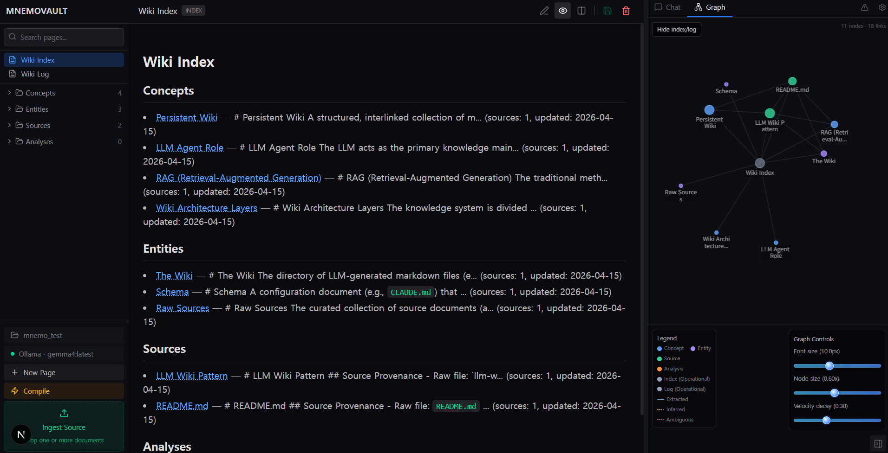
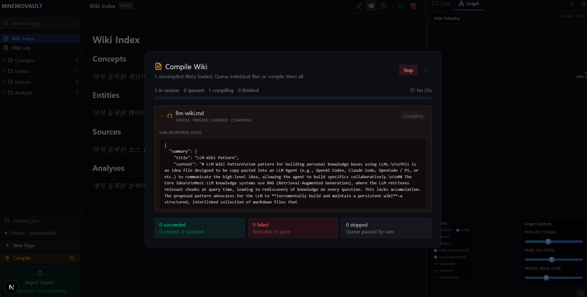

[English](./README.md) | [한국어](./README_KR.md)

# MnemoVault

MnemoVault는 Next.js로 만든 로컬 우선 LLM 위키 IDE입니다. Andrej Karpathy의 LLM Wiki v2 방향성에서 큰 영향을 받았고, 그 워크플로를 누구나 자기 컴퓨터에서 실행할 수 있게 만드는 데 초점을 두고 있습니다. 앱을 실행하고, 로컬 폴더를 연결하고, Ollama를 붙이면 원본 자료를 지속적으로 성장하는 마크다운 위키로 컴파일할 수 있습니다.

핵심 의도는 분명합니다. 호스팅 인프라나 일회성 채팅에 기대지 않고, 누구나 로컬에서 무료로 LLM-wiki 워크플로를 사용할 수 있게 하자는 것입니다.

## 왜 MnemoVault인가

일반적인 검색 기반 흐름은 질문할 때마다 문맥을 다시 조립합니다. MnemoVault는 다른 쪽에 더 가깝습니다. 지식을 위키로 컴파일하고, 시간이 지나면서 다듬고, 그 결과인 마크다운을 오래 남는 산출물로 취급합니다.

- 파일시스템에 저장되는 로컬 우선 위키
- 편집, 그래프 탐색, 채팅, 컴파일을 한곳에서 다루는 브라우저 기반 IDE
- 누구나 무료로 로컬 LLM 워크플로를 돌릴 수 있게 해주는 Ollama 지원
- 필요할 때 사용할 수 있는 OpenRouter 지원
- 불투명한 DB 상태 대신 Git 친화적인 마크다운 결과물

## 제품 소개

### 메인 앱 화면

메인 화면은 페이지 탐색, 마크다운 편집, 그래프 보기, 채팅을 한 흐름 안에서 오갈 수 있도록 만든 3단 작업 공간입니다.



### 위키 컴파일 화면

컴파일 화면에서는 원본 자료를 구조화된 위키 페이지, 연결된 노트, 근거를 포함한 지식 산출물로 변환하는 작업이 이루어집니다.



## 영감과 방향

MnemoVault는 Andrej Karpathy의 LLM Wiki v2 방향성에서 강한 영향을 받았습니다. 모델을 일시적인 답변 생성기가 아니라, 시간이 지나면서 실제 위키를 만들고 유지하도록 돕는 지식 컴파일러에 가깝게 사용하자는 생각입니다.

이 프로젝트는 공식 구현을 표방하지 않습니다. 대신 Next.js와 Ollama 기반 로컬 모델을 통해 개발자, 연구자, 그리고 관심 있는 누구나 이 방식을 직접 실행해볼 수 있도록 만든 로컬 우선 구현입니다.

## 빠른 시작

### 필요 사항

- Node.js
- Chrome 또는 Edge 같은 Chromium 기반 브라우저
- 무료 로컬 구성을 원할 경우 Ollama

로컬 워크스페이스 연결에는 File System Access API가 필요하므로 Chromium 기반 브라우저 사용을 권장합니다.

### 로컬 실행

```bash
npm install
npm run dev
```

그 다음 [http://localhost:3000](http://localhost:3000) 을 열면 됩니다.

처음 실행하면 워크스페이스로 사용할 로컬 폴더를 선택하게 됩니다. MnemoVault는 필요한 디렉터리 구조를 초기화하고, 이후 다시 열 수 있도록 핸들을 IndexedDB에 저장합니다.

## LLM 설정

### Ollama

MnemoVault는 누구나 Ollama를 통해 로컬에서 무료로 LLM wiki를 사용할 수 있도록 설계되어 있습니다.

```bash
ollama serve
ollama pull gemma4:e4b
```

기본 로컬 엔드포인트는 다음과 같습니다.

```text
http://localhost:11434
```

저장소에서는 `.env` / `.env.example`의 다음 값을 통해 읽습니다.

```env
NEXT_PUBLIC_OLLAMA_URL=http://localhost:11434
```

### OpenRouter

호스팅 모델을 쓰고 싶다면 OpenRouter도 사용할 수 있습니다.

```env
OPENROUTER_API_KEY=
OPENROUTER_MODELS=
```

두 값이 설정되어 있으면 앱 설정에서 OpenRouter를 provider로 사용할 수 있습니다.

## 성능 참고

로컬 Ollama 경험을 좋게 쓰려면 GPU가 있는 편이 확실히 좋습니다. GPU가 없어도 동작은 가능하지만, CPU만으로 추론하면 컴파일이나 질의가 꽤 느릴 수 있습니다.

로컬 모델이 느리다면 `.env`에서 Ollama timeout을 늘려 주세요.

```env
OLLAMA_REQUEST_TIMEOUT_MS=900000
```

이 값이 느린 로컬 추론에서 가장 중요한 timeout 설정입니다. 더 길게 늘릴 수도 있고, `0`으로 두면 timeout을 끌 수 있습니다.

## 구조 요약

- 브라우저가 로컬 파일 접근과 위키 상태를 담당합니다
- 앱은 편집과 탐색을 위한 IDE 형태의 인터페이스를 제공합니다
- LLM 관련 API 라우트가 ingest, query, lint를 중개합니다
- 최종 지식 베이스는 내 컴퓨터에 마크다운으로 남습니다

즉, 핵심 산출물이 이동 가능하고, 직접 확인 가능하며, Git으로 버전 관리하기 쉬운 형태로 유지됩니다.

## 기여하기

기여는 언제든 환영합니다. 제품 자체, 문서, 개발 경험, 모델 워크플로 중 어떤 부분이든 더 좋아질 수 있다면 이슈와 PR을 적극적으로 부탁드립니다.

특히 이런 기여가 큰 도움이 됩니다.

- 버그나 불편한 사용 흐름 제보
- LLM wiki 경험을 더 좋게 만드는 워크플로 제안
- 문서, 온보딩, 스크린샷 개선
- 로컬 모델 및 브라우저 환경 테스트

이슈를 올릴 때는 상황 설명과 재현 방법이 있으면 정말 도움이 됩니다. PR은 작고 집중된 변경일수록 리뷰하기 좋습니다.

## 이슈와 피드백

뭔가 깨져 있거나, 헷갈리거나, 아직 덜 만들어졌다고 느껴지면 편하게 이슈를 열어 주세요. 특히 로컬 LLM-wiki 워크플로를 더 쉽게, 더 실용적으로 만드는 제안은 언제나 반갑습니다.

## 라이선스

MIT
